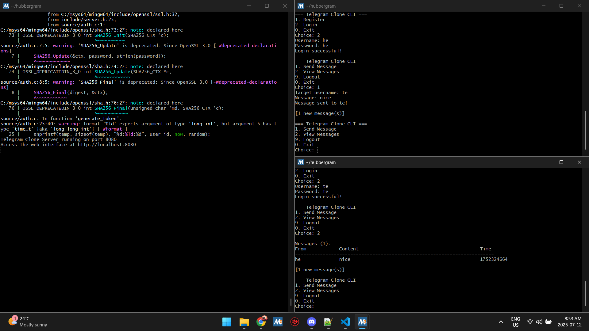
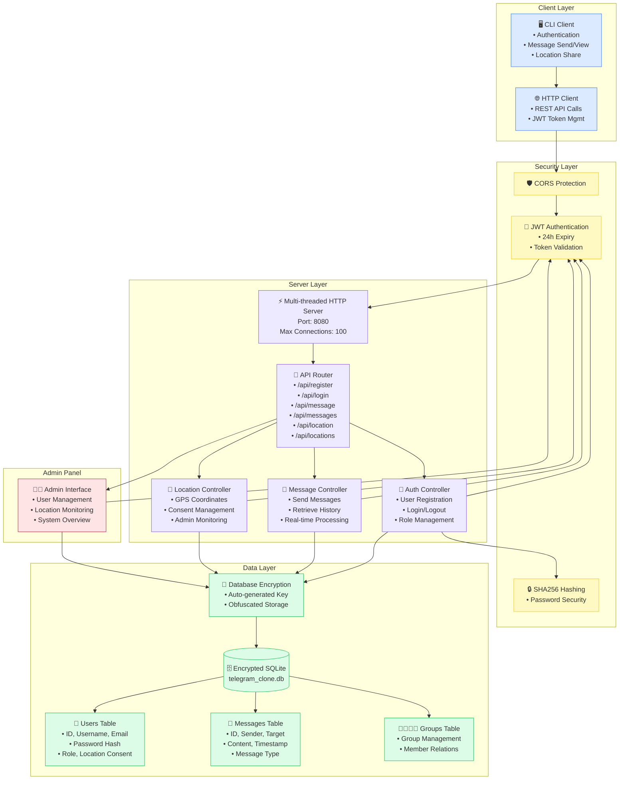

# Hubbergram - Secure Telegram Clone

A lightweight, secure messaging server with CLI client built in C, featuring encrypted database storage, JWT authentication, and location sharing with explicit consent.

## 🚀 Features

### Core Messaging
- **User Registration & Authentication** - Secure account creation with SHA256 password hashing
- **Real-time Messaging** - Send and receive messages between users
- **Message History** - View conversation history with timestamps
- **JWT Token Authentication** - Secure session management with 24-hour expiry

### Privacy & Security
- **Encrypted Database** - SQLite database with custom encryption key
- **Location Sharing** - GPS coordinates sharing with explicit user consent
- **Admin Panel** - Administrative interface for user location monitoring
- **Role-based Access** - Regular users and admin roles with different permissions

### Technical Features
- **Multi-threaded Server** - Handles multiple concurrent connections
- **HTTP REST API** - Clean API endpoints for all operations
- **Cross-platform** - Works on Windows (MSYS2), Linux, and macOS
- **CLI Interface** - Command-line client for easy interaction



## 🏗️ Architecture



## 📋 Prerequisites

### Windows (MSYS2)
```bash
# Install MSYS2 from https://www.msys2.org/
# Then install dependencies:
pacman -S mingw-w64-x86_64-gcc mingw-w64-x86_64-sqlite3 mingw-w64-x86_64-json-c mingw-w64-x86_64-openssl mingw-w64-x86_64-make git
```

### Ubuntu/Debian
```bash
sudo apt-get update
sudo apt-get install libsqlite3-dev libjson-c-dev libssl-dev build-essential git
```

### CentOS/RHEL
```bash
sudo yum install sqlite-devel json-c-devel openssl-devel gcc make git
```

### macOS
```bash
brew install sqlite json-c openssl
```

## 🔧 Installation

### 1. Clone Repository
```bash
git clone https://github.com/codehubbers/hubbergram
cd hubbergram
```

### 2. Build Server
```bash
# Automatic build with dependency management (preferred)
make all

# Or manual dependency installation
make install-libmingw32  # Downloads required networking library
make                     # Build server
```

### 3. Build CLI Client
```bash
make -f Makefile_cli
```

### 4. Database Setup
The server automatically:
- Generates a secure encryption key
- Creates encrypted SQLite database
- Sets up required tables (users, messages, groups)
- Creates default admin account

## 🚀 Usage

### Start Server
```bash
./build/telegram_clone
# Server runs on http://localhost:8080
```

### Run CLI Client
```bash
./cli_client
```

### Default Admin Account
- **Username:** `admin`
- **Password:** `admin123`

## 📱 CLI Commands

### For All Users
1. **Register** - Create new user account
2. **Login** - Authenticate with username/password
3. **Send Message** - Send message to specific user
4. **View Messages** - See received messages
5. **Logout** - End current session

### Admin Only
- **View Locations** - Monitor user locations (requires consent)

## 🔌 API Endpoints

| Method | Endpoint | Description | Auth Required |
|--------|----------|-------------|---------------|
| POST | `/api/register` | User registration | No |
| POST | `/api/login` | User authentication | No |
| POST | `/api/message` | Send message | Yes |
| GET | `/api/messages` | Get user messages | Yes |
| POST | `/api/location` | Update location | Yes |
| GET | `/api/locations` | View all locations | Admin |

### Example API Usage

#### Register User
```bash
curl -X POST http://localhost:8080/api/register \
  -H "Content-Type: application/json" \
  -d '{"username":"john","email":"john@example.com","password":"secret123"}'
```

#### Send Message
```bash
curl -X POST http://localhost:8080/api/message \
  -H "Content-Type: application/json" \
  -H "Authorization: Bearer YOUR_TOKEN" \
  -d '{"target_username":"jane","content":"Hello!"}'
```

## 🔒 Security Features

### Database Security
- **Encrypted Storage** - All data encrypted at rest
- **Auto-generated Keys** - Unique encryption key per installation
- **Secure Key Storage** - Obfuscated key storage in headers

### Authentication
- **SHA256 Hashing** - Secure password storage
- **JWT Tokens** - Stateless authentication
- **Token Expiry** - 24-hour automatic expiration
- **Rate Limiting** - Protection against brute force attacks

### Privacy
- **Explicit Consent** - Location sharing requires user permission
- **Data Minimization** - Only necessary data collected
- **Admin Separation** - Clear role-based access control

## 🛠️ Configuration

Edit `include/config.h` to customize:

```c
#define SERVER_PORT 8080              // Server port
#define MAX_CONNECTIONS 100           // Max concurrent clients
#define TOKEN_EXPIRY_HOURS 24         // JWT token lifetime
#define DEFAULT_LOCATION_DURATION 60  // Location sharing duration
#define REQUIRE_LOCATION_CONSENT 1    // Enforce location consent
```

## 📁 Project Structure

```
hubbergram/
├── include/          # Header files
│   ├── server.h      # Main server definitions
│   ├── config.h      # Configuration constants
│   └── db_security.h # Database encryption
├── source/           # Source code
│   ├── server.c      # HTTP server & routing
│   ├── api.c         # REST API endpoints
│   ├── database.c    # SQLite operations
│   ├── auth.c        # Authentication & JWT
│   └── db_security.c # Database encryption
├── build/            # Compiled objects & executable
├── cli_client.c      # Command-line client
├── Makefile          # Server build configuration
└── Makefile_cli      # Client build configuration
```

## 🐛 Troubleshooting

### Build Issues
```bash
# Clean build
make clean && make all

# Check dependencies
make deps-msys2  # On MSYS2
```

### Connection Issues
```bash
# Check if server is running
curl http://localhost:8080/

# Check port availability
netstat -an | grep 8080
```

### Database Issues (!!! Important to not lose any message history !!!)
```bash
# Backup and rebuild database
./build_with_db_merge.sh
```

## 🤝 Contributing

1. Fork the repository
2. Create feature branch (`git checkout -b feature/amazing-feature`)
3. Commit changes (`git commit -m 'Add amazing feature'`)
4. Push to branch (`git push origin feature/amazing-feature`)
5. Open Pull Request

## 📄 License

This project is licensed under the MIT License - see the LICENSE file for details.

## 📞 Support

For issues and questions:
1. Check existing GitHub issues
2. Create new issue with detailed description
3. Include system information and error logs

---

#### Built with ❤️ using C, SQLite, and JSON-C**
---

#### Also credit for CoderRC([code>_hub profile](https://codehubbers.com/profile/CoderRC/)) [@CoderRC/libmingw32_extended](https://github.com/CoderRC/libmingw32_extended)**
---

#### 🫀Idea Credit: Ziqian-Huang0607([code>_hub profile](https://codehubbers.com/profile/Ziqian-Huang0607/))